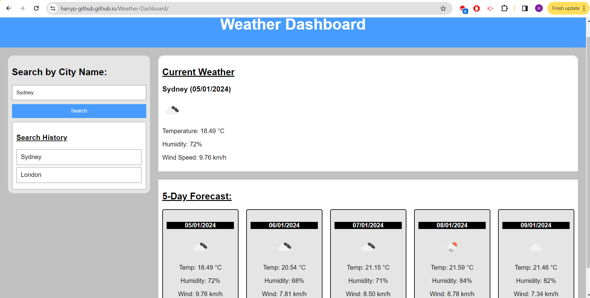

# Weather Dashboard

## Description

This project was to create a Weather Dashboard which would enable the traveller to search for a City and display the Current Weather and a five day forecast for the City so they can plan their trip accordingly. Multiple cities can be saved in the local storage and displayed in the search history section. When the user user views the forecasts, they will see the city name, date, weather image reflective of the conditions, temperature, humidity and windspeed. The traveller can also use the search history section to click on previously searched cities for quick access for their current and future weather conditions.

## Installation

N/A

## Usage

To use this page, go to the search input box and type in the name of a city. You will find the Current Weather located in the top section and below that will be the Five Day Forecast. Keep in mind that the Weather may not be accurate to your current weather, as the API has it's forecast every 3 hours. You will see all the weather being shown on the screen. Also, the Cities will be saved in the local storage and will be displayed in the Search History section, where you can click on previously searched Cities to check the weather.

## Credits

Page made by me.

Info From Teachers/Class Material + A Lot Of Internet Sources

And https://openweathermap.org/forecast5 and https://openweathermap.org/api/geocoding-api to understand the API and it's formatting

## License 

N/A

## Deployed Website link

[Click for Application](https://harryp-github.github.io/Weather-Dashboard//)

[Click for Repo](https://github.com/HarryP-GitHub/Weather-Dashboard)

## Deployed Website image

